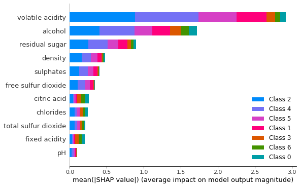
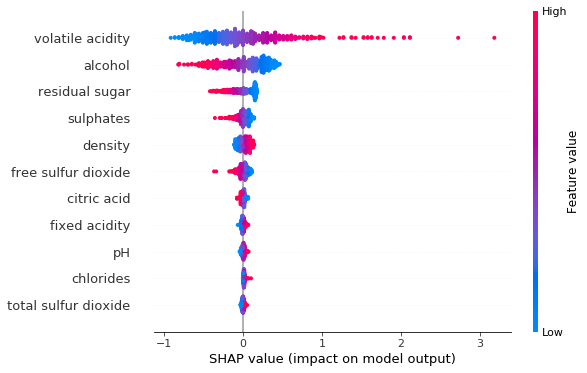

# wine_quality_pytorch
 Wine quality prediction neural net model implemented using pytorch with shap explantion of model results. 

# Explainer Exploration
```python
from data_model import WineData, WHITE_WINE_PATH, RED_WINE_PATH
from network import run
from torch.utils.data import Dataset, DataLoader

```

# Explaining pytorch model of wine quality dataset using Shap

## Train class_weights 
Firstly let's run the training loop and save the resulting 

*NOTE*: The model has 7 classes so accuracy is calculated here for a multiclass problem where a random
guess gives us a 1/7 (0.14) random probability of being correct, not taking class distribution into account.  


```python
model = run()
```

    Epoch[50] Loss:[0.69]
    EVALUATOR: Training Results - Epoch: 50  Avg accuracy: 0.51  Avg loss: 0.8062
    Epoch[100] Loss:[0.86]
    EVALUATOR: Training Results - Epoch: 100  Avg accuracy: 0.51  Avg loss: 0.7985
    Epoch[150] Loss:[0.77]
    EVALUATOR: Training Results - Epoch: 150  Avg accuracy: 0.51  Avg loss: 0.7935
    Epoch[200] Loss:[1.02]
    EVALUATOR: Training Results - Epoch: 200  Avg accuracy: 0.52  Avg loss: 0.7920
    Epoch[250] Loss:[0.72]
    EVALUATOR: Training Results - Epoch: 250  Avg accuracy: 0.51  Avg loss: 0.7905
    Epoch[300] Loss:[0.79]
    EVALUATOR: Training Results - Epoch: 300  Avg accuracy: 0.52  Avg loss: 0.7885
    Epoch[350] Loss:[0.73]
    EVALUATOR: Training Results - Epoch: 350  Avg accuracy: 0.52  Avg loss: 0.7882
    Epoch[400] Loss:[0.71]
    EVALUATOR: Training Results - Epoch: 400  Avg accuracy: 0.52  Avg loss: 0.7877
    Epoch[450] Loss:[0.81]
    EVALUATOR: Training Results - Epoch: 450  Avg accuracy: 0.52  Avg loss: 0.7872
    Epoch[500] Loss:[0.74]
    EVALUATOR: Training Results - Epoch: 500  Avg accuracy: 0.52  Avg loss: 0.7867
    Epoch[550] Loss:[0.88]
    EVALUATOR: Training Results - Epoch: 550  Avg accuracy: 0.52  Avg loss: 0.7865
    Epoch[600] Loss:[0.66]
    EVALUATOR: Training Results - Epoch: 600  Avg accuracy: 0.53  Avg loss: 0.7931
    Epoch[650] Loss:[0.71]
    EVALUATOR: Training Results - Epoch: 650  Avg accuracy: 0.51  Avg loss: 0.7875
    Epoch[700] Loss:[0.78]
    EVALUATOR: Training Results - Epoch: 700  Avg accuracy: 0.51  Avg loss: 0.7877
    Epoch[750] Loss:[0.73]
    EVALUATOR: Training Results - Epoch: 750  Avg accuracy: 0.52  Avg loss: 0.7861
    Epoch[800] Loss:[0.89]
    EVALUATOR: Training Results - Epoch: 800  Avg accuracy: 0.51  Avg loss: 0.7872
    Epoch[850] Loss:[0.82]
    EVALUATOR: Training Results - Epoch: 850  Avg accuracy: 0.52  Avg loss: 0.7861
    Epoch[900] Loss:[0.83]
    EVALUATOR: Training Results - Epoch: 900  Avg accuracy: 0.52  Avg loss: 0.7857
    Epoch[950] Loss:[0.78]
    EVALUATOR: Training Results - Epoch: 950  Avg accuracy: 0.52  Avg loss: 0.7856
    Epoch[1000] Loss:[0.7]
    EVALUATOR: Training Results - Epoch: 1000  Avg accuracy: 0.52  Avg loss: 0.7854


## Get Wine Data
Using the dataset and dataloader specified in data_model.py we import a train and test data set
and create a dataloader for each


```python
data = WineData.read_data(WHITE_WINE_PATH)

train_data, test_data = WineData.train_test_splitter(data)

wd = WineData(train_data)
wd_test = WineData(test_data)

```

## Create DeepExplainer
Using our model we create a new instance of the `shap.DeepExplainer()` using the train data's x values as background inputs.

Shap will provide us with an *approximation* of the model's behaviour **not** the underlying data itself. 
That is to say shap approximates the model, which we hope represents our data well. However if our model is a bad fit
shap will give us an approxmiation of a bad model. 

 *garbage in, garbage out*. 


```python
import shap
```


```python
# explainer will use the first 1000 instances in x_data
e = shap.DeepExplainer(model, wd.x_data[:1000] )
```


```python
wd.x_data.shape
```


    torch.Size([4408, 11])


```python
quality = [i+3 for i in range(7)]
```


```python
quality
```


[3, 4, 5, 6, 7, 8, 9]


```python
for q, w in zip(quality, wd.class_weights.data):
    print(q,"hello")
```

    3 hello
    4 hello
    5 hello
    6 hello
    7 hello
    8 hello
    9 hello


```python
# shap values can take a really long time to calculate
# let's limit the shap values to the first 1000 rows in `wd.x_data`
shap_values = e.shap_values(wd.x_data[:1000])
```


```python
FEATURE_NAMES =["fixed acidity","volatile acidity","citric acid","residual sugar","chlorides","free sulfur dioxide","total sulfur dioxide","density","pH","sulphates","alcohol"
]
```


# Summarizing The Model For All Classes


```python
shap.summary_plot(shap_values, wd.x_data[:100],feature_names=FEATURE_NAMES)
```





# Model Summary For Class 0 (e.g. worst quality)


```python
shap.summary_plot(shap_values[0][0:500], wd.x_data[:500], feature_names=FEATURE_NAMES)
```


# Model Summary For Class 1 


```python
shap.summary_plot(shap_values[1][0:500], wd.x_data[:500], feature_names=FEATURE_NAMES)
```





# Model Summary For Class 2


```python
shap.summary_plot(shap_values[2][0:500], wd.x_data[:500], feature_names=FEATURE_NAMES)
```


# Model Summary For Class 3 


```python
shap.summary_plot(shap_values[3][0:500], wd.x_data[:500], feature_names=FEATURE_NAMES)
```


# Model Summary For Class 4 


```python
shap.summary_plot(shap_values[4][0:500], wd.x_data[:500], feature_names=FEATURE_NAMES)
```


# Model Summary For Class 5 


```python
shap.summary_plot(shap_values[5][0:500], wd.x_data[:500], feature_names=FEATURE_NAMES)
```


# Model Summary For Class 6 


```python
shap.summary_plot(shap_values[0][0:500], wd.x_data[:500], feature_names=FEATURE_NAMES)
```


```python
shap.summary_plot(shap_values[5][0:500], wd.x_data[:500], feature_names=FEATURE_NAMES)
```


```python

```

