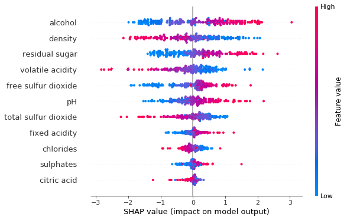

```python
from data_model import WineData, WHITE_WINE_PATH, RED_WINE_PATH
from network import run
from torch.utils.data import Dataset, DataLoader

```

# Explaining pytorch model of wine quality dataset using Shap

### Train model
Firstly let's run the training loop and save the resulting model.

*NOTE*: The model has 7 classes so accuracy is calculated here for a multiclass problem where a random
guess gives us a 1/7 (0.14) random probability of being correct. The model takes class weights and distribution into account so the loss function is trying to optimize with class distribution taken into account. 


```python
model = run()
```

    Epoch[50] Loss:[0.71]
    EVALUATOR: Training Results - Epoch: 50  Avg accuracy: 0.51  Avg loss: 0.7978
    Epoch[100] Loss:[0.64]
    EVALUATOR: Training Results - Epoch: 100  Avg accuracy: 0.51  Avg loss: 0.7821
    Epoch[150] Loss:[0.79]
    EVALUATOR: Training Results - Epoch: 150  Avg accuracy: 0.52  Avg loss: 0.7678
    Epoch[200] Loss:[0.91]
    EVALUATOR: Training Results - Epoch: 200  Avg accuracy: 0.54  Avg loss: 0.7728
    Epoch[250] Loss:[0.81]
    EVALUATOR: Training Results - Epoch: 250  Avg accuracy: 0.54  Avg loss: 0.7615
    Epoch[300] Loss:[0.86]
    EVALUATOR: Training Results - Epoch: 300  Avg accuracy: 0.53  Avg loss: 0.7600
    Epoch[350] Loss:[0.81]
    EVALUATOR: Training Results - Epoch: 350  Avg accuracy: 0.55  Avg loss: 0.7664
    Epoch[400] Loss:[0.64]
    EVALUATOR: Training Results - Epoch: 400  Avg accuracy: 0.54  Avg loss: 0.7533
    Epoch[450] Loss:[0.78]
    EVALUATOR: Training Results - Epoch: 450  Avg accuracy: 0.54  Avg loss: 0.7530
    Epoch[500] Loss:[0.75]
    EVALUATOR: Training Results - Epoch: 500  Avg accuracy: 0.53  Avg loss: 0.7544
    Epoch[550] Loss:[0.87]
    EVALUATOR: Training Results - Epoch: 550  Avg accuracy: 0.54  Avg loss: 0.7543
    Epoch[600] Loss:[0.69]
    EVALUATOR: Training Results - Epoch: 600  Avg accuracy: 0.54  Avg loss: 0.7518
    Epoch[650] Loss:[0.72]
    EVALUATOR: Training Results - Epoch: 650  Avg accuracy: 0.54  Avg loss: 0.7527
    Epoch[700] Loss:[0.94]
    EVALUATOR: Training Results - Epoch: 700  Avg accuracy: 0.55  Avg loss: 0.7592
    Epoch[750] Loss:[0.73]
    EVALUATOR: Training Results - Epoch: 750  Avg accuracy: 0.55  Avg loss: 0.7504
    Epoch[800] Loss:[0.76]
    EVALUATOR: Training Results - Epoch: 800  Avg accuracy: 0.55  Avg loss: 0.7507
    Epoch[850] Loss:[0.84]
    EVALUATOR: Training Results - Epoch: 850  Avg accuracy: 0.54  Avg loss: 0.7496
    Epoch[900] Loss:[0.81]
    EVALUATOR: Training Results - Epoch: 900  Avg accuracy: 0.55  Avg loss: 0.7580
    Epoch[950] Loss:[0.65]
    EVALUATOR: Training Results - Epoch: 950  Avg accuracy: 0.55  Avg loss: 0.7498
    Epoch[1000] Loss:[0.71]
    EVALUATOR: Training Results - Epoch: 1000  Avg accuracy: 0.54  Avg loss: 0.7524
    Epoch[1050] Loss:[0.7]
    EVALUATOR: Training Results - Epoch: 1050  Avg accuracy: 0.55  Avg loss: 0.7548
    Epoch[1100] Loss:[0.75]
    EVALUATOR: Training Results - Epoch: 1100  Avg accuracy: 0.55  Avg loss: 0.7496
    Epoch[1150] Loss:[0.78]
    EVALUATOR: Training Results - Epoch: 1150  Avg accuracy: 0.55  Avg loss: 0.7474
    Epoch[1200] Loss:[0.72]
    EVALUATOR: Training Results - Epoch: 1200  Avg accuracy: 0.55  Avg loss: 0.7507
    Epoch[1250] Loss:[0.81]
    EVALUATOR: Training Results - Epoch: 1250  Avg accuracy: 0.52  Avg loss: 0.7531
    Epoch[1300] Loss:[0.64]
    EVALUATOR: Training Results - Epoch: 1300  Avg accuracy: 0.55  Avg loss: 0.7530
    Epoch[1350] Loss:[0.71]
    EVALUATOR: Training Results - Epoch: 1350  Avg accuracy: 0.55  Avg loss: 0.7485
    Epoch[1400] Loss:[0.71]
    EVALUATOR: Training Results - Epoch: 1400  Avg accuracy: 0.55  Avg loss: 0.7540
    Epoch[1450] Loss:[0.88]
    EVALUATOR: Training Results - Epoch: 1450  Avg accuracy: 0.55  Avg loss: 0.7489
    Epoch[1500] Loss:[0.73]
    EVALUATOR: Training Results - Epoch: 1500  Avg accuracy: 0.54  Avg loss: 0.7504
    Epoch[1550] Loss:[0.99]
    EVALUATOR: Training Results - Epoch: 1550  Avg accuracy: 0.55  Avg loss: 0.7490
    Epoch[1600] Loss:[0.79]
    EVALUATOR: Training Results - Epoch: 1600  Avg accuracy: 0.56  Avg loss: 0.7501
    Epoch[1650] Loss:[0.7]
    EVALUATOR: Training Results - Epoch: 1650  Avg accuracy: 0.55  Avg loss: 0.7499
    Epoch[1700] Loss:[0.7]
    EVALUATOR: Training Results - Epoch: 1700  Avg accuracy: 0.53  Avg loss: 0.7473
    Epoch[1750] Loss:[0.69]
    EVALUATOR: Training Results - Epoch: 1750  Avg accuracy: 0.55  Avg loss: 0.7473
    Epoch[1800] Loss:[0.71]
    EVALUATOR: Training Results - Epoch: 1800  Avg accuracy: 0.53  Avg loss: 0.7636
    Epoch[1850] Loss:[0.69]
    EVALUATOR: Training Results - Epoch: 1850  Avg accuracy: 0.55  Avg loss: 0.7514
    Epoch[1900] Loss:[0.93]
    EVALUATOR: Training Results - Epoch: 1900  Avg accuracy: 0.56  Avg loss: 0.7479
    Epoch[1950] Loss:[0.84]
    EVALUATOR: Training Results - Epoch: 1950  Avg accuracy: 0.56  Avg loss: 0.7484
    Epoch[2000] Loss:[0.67]
    EVALUATOR: Training Results - Epoch: 2000  Avg accuracy: 0.56  Avg loss: 0.7483


## Get Wine Data
Using the dataset and dataloader specified in data_model.py we import a train and test data set
and create a dataloader for each


```python
data = WineData.read_data(WHITE_WINE_PATH)

train_data, test_data = WineData.train_test_splitter(data)

wd = WineData(train_data)
wd_test = WineData(test_data)

```

## Create DeepExplainer
Using our model we create a new instance of the `shap.DeepExplainer()` using the train data's x values as background inputs.

Shap will provide us with an *approximation* of the model's behaviour **not** the underlying data itself. 
That is to say shap approximates the model, which we hope represents our data well. However if our model is a bad fit
shap will give us an approxmiation of a bad model. 

 *garbage in, garbage out*. 


```python
import shap
```


```python
# explainer will use the first 1000 instances in x_data
e = shap.DeepExplainer(model, wd.x_data)
```


```python
wd.x_data.shape
```


    torch.Size([4408, 11])


```python
# shap values can take a really long time to calculate
# let's limit the shap values to the first 200 rows in `wd.x_data`
shap_values = e.shap_values(wd.x_data[:200])
```


```python
FEATURE_NAMES =["fixed acidity","volatile acidity","citric acid","residual sugar","chlorides","free sulfur dioxide","total sulfur dioxide","density","pH","sulphates","alcohol"
]
```


# Summarizing The Model For All Classes


```python
shap.summary_plot(shap_values, wd.x_data[:200],feature_names=FEATURE_NAMES)
```


# Model Summary For Class 0 (e.g. worst quality)


```python
shap.summary_plot(shap_values[0][0:200], wd.x_data[:200], feature_names=FEATURE_NAMES)
```


# Model Summary For Class 1 


```python
shap.summary_plot(shap_values[1][0:200], wd.x_data[:200], feature_names=FEATURE_NAMES)
```


# Model Summary For Class 2


```python
shap.summary_plot(shap_values[2][0:200], wd.x_data[:200], feature_names=FEATURE_NAMES)
```


# Model Summary For Class 3 


```python
shap.summary_plot(shap_values[3][0:200], wd.x_data[:200], feature_names=FEATURE_NAMES)
```


# Model Summary For Class 4 


```python
shap.summary_plot(shap_values[4][0:200], wd.x_data[:200], feature_names=FEATURE_NAMES)
```


# Model Summary For Class 5 


```python
shap.summary_plot(shap_values[5][0:200], wd.x_data[:200], feature_names=FEATURE_NAMES)
```





# Model Summary For Class 6 


```python
shap.summary_plot(shap_values[6][0:200], wd.x_data[:200], feature_names=FEATURE_NAMES)
```


The overall class summary for all 6 classes makes class 6 (the highest quality) look a bit suspect. Let's look closer at the class weights to see how the quality ratings are distributed, as the problem could likely be down to a lack of training data for both classes, thus model may not have learned how to represent and predict well enough for this class. 


```python
quality = [i+3 for i in range(7)]
```


```python
quality
```


[3, 4, 5, 6, 7, 8, 9]


```python
for q, w, i in zip(quality, wd.class_weights.data,[i for i in range(7)]):
    print(f"Index {i} represents quality: {q} with class weight {w}")
```

    Index 0 represents quality: 3 with class weight 0.004083484411239624
    Index 1 represents quality: 4 with class weight 0.033348456025123596
    Index 2 represents quality: 5 with class weight 0.29741379618644714
    Index 3 represents quality: 6 with class weight 0.44872957468032837
    Index 4 represents quality: 7 with class weight 0.17967331409454346
    Index 5 represents quality: 8 with class weight 0.03561706095933914
    Index 6 represents quality: 9 with class weight 0.0011343013029545546


```python

```

# Summary
Clearly there are only few instances of wine's of class 6. Given that 76% of all wines are rated 6 and below. It might be better to split this problem into a binary classification task of predicting wines as bad (class 0 - 3) or good (class 4-6).


```python

```
